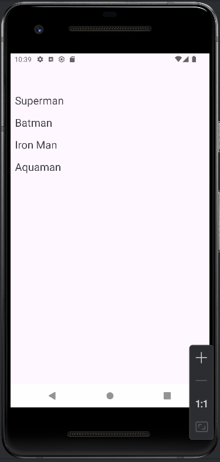
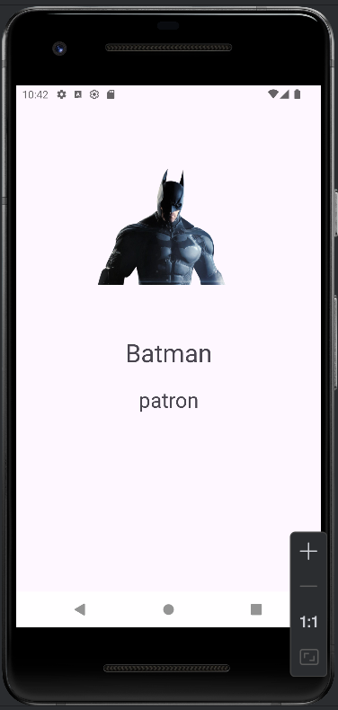

# 🦸‍♂️ Süper Kahraman Kitabı

Kotlin ile geliştirilmiş, süper kahramanları listeleyen ve detaylarını gösteren modern Android uygulaması.

## 📱 Ekran Görüntüleri

<p align="center">
  
  
</p>

## ✨ Özellikler

- 📋 **RecyclerView Listesi** - Süper kahramanlar düzenli liste halinde
- 🎯 **Tıklanabilir Kartlar** - Her kahraman detay sayfasına yönlendirme
- 🖼️ **Görsel Gösterim** - Kahramanların yüksek kaliteli görselleri
- 📝 **Detaylı Bilgi** - İsim ve meslek bilgileri
- 🎨 **Modern UI** - Material Design ve ViewBinding
- 🔄 **Singleton Pattern** - Etkili veri paylaşımı

## 🛠️ Kullanılan Teknolojiler

- **Dil:** Kotlin
- **Minimum SDK:** API 24 (Android 7.0)
- **UI Framework:** Android XML Layouts
- **View Binding:** Tip güvenli view erişimi
- **RecyclerView:** Liste yönetimi
- **Singleton Pattern:** Activity'ler arası veri aktarımı

## 🦸 Uygulama İçeriği

Uygulamada yer alan süper kahramanlar:

| Kahraman | Meslek | Özellik |
|----------|--------|---------|
| 🦸 Superman | Gazeteci | Uçma, süper güç |
| 🦇 Batman | Patron | Zeka, teknoloji |
| 🔴 Iron Man | Holding Sahibi | Zırh, teknoloji |
| 🌊 Aquaman | Kral | Su kontrolü |

## 🎯 Kullanılan Tasarım Desenleri

### 1️⃣ Singleton Pattern
Activity'ler arası veri paylaşımı için kullanıldı:
```kotlin
object MySingleton {
    var secilensuperKahraman : superKahraman? = null
}
```

**Kullanım Amacı:** Intent ile veri aktarımı yerine global erişim sağlar.

### 2️⃣ ViewHolder Pattern
RecyclerView performans optimizasyonu:
```kotlin
class superKahramanViewHolder(val binding: RecyclerRowBinding) : 
    RecyclerView.ViewHolder(binding.root)
```

**Avantajı:** findViewById çağrılarını azaltarak performansı artırır.

### 3️⃣ Master-Detail Flow
Liste → Detay ekran akışı:
- **Master:** MainActivity (Liste)
- **Detail:** tanitimAktivitesi (Detay)


### Uygulama Akışı
```
1. MainActivity açılır
   ↓
2. RecyclerView'da 4 kahraman listelenir
   ↓
3. Kullanıcı bir kahramana tıklar
   ↓
4. Adapter tıklamayı yakalar
   ↓
5. Seçilen kahraman MySingleton'a kaydedilir
   ↓
6. tanitimAktivitesi başlatılır
   ↓
7. Kahramanın görseli, ismi ve mesleği gösterilir
```

### Veri Aktarımı

**Eski Yöntem (Yorum satırında):**
```kotlin
intent.putExtra("secilenKahraman", superKahraman)
```

**Yeni Yöntem (Aktif):**
```kotlin
MySingleton.secilensuperKahraman = superKahramanListesi[position]
```

